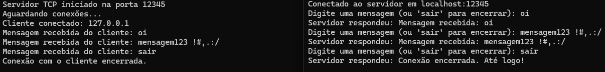

Implementação uma comunicação cliente-servidor utilizando o protocolo TCP em Java.

## ServidorTCP

O programa ServidorTCP atua como o servidor na comunicação:

- Escuta conexões de clientes em uma porta especificada.
- Aceita conexões de um cliente por vez.
- Recebe mensagens enviadas pelos clientes e responde com uma confirmação.
- Encerra a conexão com o cliente quando a mensagem "sair" é recebida.

## ClienteTCP

O programa ClienteTCP atua como o cliente na comunicação:

- Conecta-se a um servidor TCP em um endereço e porta especificados.
- Permite que o usuário envie mensagens ao servidor.
- Recebe e exibe as respostas enviadas pelo servidor.
- Encerra a conexão quando o usuário digita "sair".

## Execução

Para executar os programas, abrir 2 terminais diferentes na pasta, um para cada programa:

1. No primeiro terminal, executar o comando 'java ServidorTCP'.
2. No segundo terminal, executar 'java ClienteTCP'.
3. No terminal do cliente pode-se enviar as mensagens, que podem ser vistas sendo recebidas no terminal do servidor.
4. No terminal do cliente digite 'sair' para desconectar.

## Exemplo de funcionamento

Servidor | Cliente

